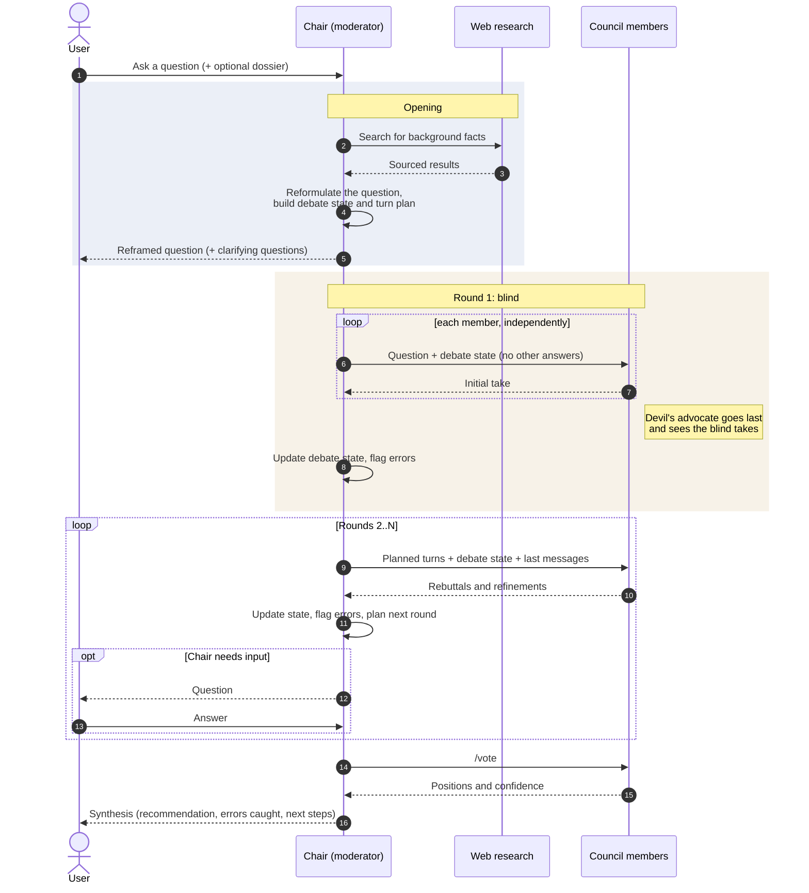

# Session flow

A standard council session, at a high level. Pause/resume, memory, the budget
checks and `/summon` are left out.

```mermaid
sequenceDiagram
    autonumber
    actor User
    participant Chair as Chair (moderator)
    participant Web as Web research
    participant Members as Council members

    User->>Chair: Ask a question (+ optional dossier)

    rect rgba(120,150,200,0.15)
    note over Chair,Web: Opening
    Chair->>Web: Search for background facts
    Web-->>Chair: Sourced results
    Chair->>Chair: Reformulate the question,<br/>build debate state and turn plan
    Chair-->>User: Reframed question (+ clarifying questions)
    end

    rect rgba(200,170,100,0.15)
    note over Chair,Members: Round 1: blind
    loop each member, independently
        Chair->>Members: Question + debate state (no other answers)
        Members-->>Chair: Initial take
    end
    note right of Members: Devil's advocate goes last<br/>and sees the blind takes
    Chair->>Chair: Update debate state, flag errors
    end

    loop Rounds 2..N
        Chair->>Members: Planned turns + debate state + last messages
        Members-->>Chair: Rebuttals and refinements
        Chair->>Chair: Update state, flag errors, plan next round
        opt Chair needs input
            Chair-->>User: Question
            User->>Chair: Answer
        end
    end

    Chair->>Members: /vote
    Members-->>Chair: Positions and confidence
    Chair-->>User: Synthesis (recommendation, errors caught, next steps)
```
